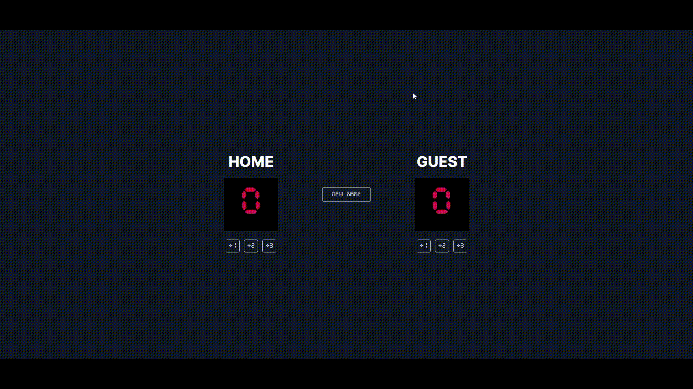

# Basketball Scoreboard

🀠I practiced the things I learned so far in the Scrimba JavaScript and implemented this solo project. 
🏀 In this solo project, I practiced how to manipulate the DOM and use events to change HTML.

## Demo
